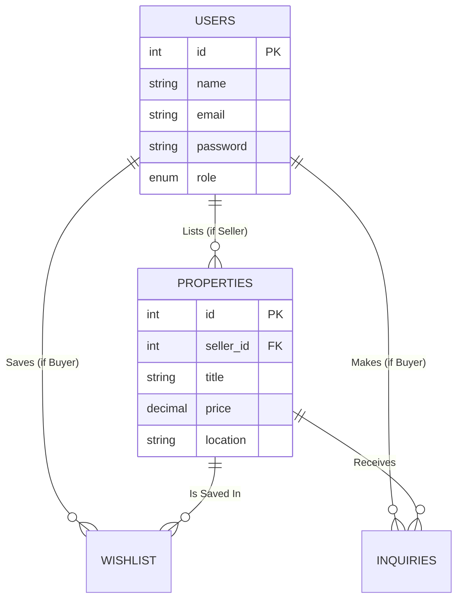

# Final Project Submission: HomeHunt

---

## 1. Project Proposal

**Project Title**
HomeHunt – Real Estate Portal System

**Problem Solved**
In the current real estate sector, property-related information is often scattered across multiple platforms such as websites, social media, and offline sources. This makes it difficult for buyers to find suitable properties efficiently, and challenging for sellers to manage their listings effectively. Furthermore, communication between buyers and sellers is often slow, unorganized, and lacks a structured system.

**Target Users**
1. Property Buyers
2. Property Sellers / Agents
3. Real Estate Agencies / Companies

**Main Features**
1. User Signup and Login system
2. Role-based system (Admin / Seller / Buyer)
3. Property listing (Add, Edit, Delete)
4. Property search and filtering system
5. Property details view with images
6. Contact / Inquiry system
7. Wishlist / Favorite properties
8. Dashboard with overview

**Why it is useful**
HomeHunt brings all real estate activities into one integrated platform. Buyers can easily search and filter properties based on preferences, while sellers can seamlessly publish and manage their property listings. By centralizing the buying, selling, and communication processes, the entire real estate journey becomes much more organized, secure, and streamlined.

---

## 2. Technical Documentation

**Technology Stack**
* **Frontend:** HTML5, CSS3 (Vanilla, Glassmorphism UI), Vanilla JavaScript
* **Backend API:** Node.js, Express.js
* **Backend Processing:** PHP (Specifically for handling secure image file uploads)
* **Database:** MySQL

**Database Schema**
* **`users` table**
  * `id` (INT, Primary Key, Auto Increment)
  * `name` (VARCHAR)
  * `email` (VARCHAR, Unique)
  * `password` (VARCHAR, Hashed)
  * `role` (ENUM: 'admin', 'seller', 'buyer')
  * `created_at` (TIMESTAMP)
* **`properties` table**
  * `id` (INT, Primary Key, Auto Increment)
  * `seller_id` (INT, Foreign Key referencing `users.id`)
  * `title`, `description`, `price`, `location` (Various types)
  * `image_url` (VARCHAR)
* **`wishlist` table**
  * `id` (INT, Primary Key)
  * `buyer_id` (INT, Foreign Key referencing `users.id`)
  * `property_id` (INT, Foreign Key referencing `properties.id`)
* **`inquiries` table**
  * `id` (INT, Primary Key)
  * `buyer_id` (INT, Foreign Key referencing `users.id`)
  * `property_id` (INT, Foreign Key referencing `properties.id`)
  * `message` (TEXT), `status` (ENUM)

**ER Diagram**

**ERD Relationship Description**
The database is built around four core entities, centered primarily on the `USERS` and `PROPERTIES` tables:
1. **One-to-Many: Users to Properties (1:N)** 
   A single user (with the role of a *Seller*) can list multiple properties. However, each property belongs to exactly one seller. This relationship is enforced by the `seller_id` foreign key in the `PROPERTIES` table.
2. **Many-to-Many: Users to Properties via Wishlist (M:N)**
   A user (*Buyer*) can save multiple properties to their wishlist, and a single property can be saved by multiple buyers. To resolve this many-to-many relationship, the `WISHLIST` table acts as a junction (mapping) table, storing both `buyer_id` and `property_id`.
3. **Many-to-Many: Users to Properties via Inquiries (M:N)**
   Similarly, a buyer can make inquiries on multiple properties, and a property can receive inquiries from multiple buyers. The `INQUIRIES` table resolves this, containing foreign keys for both the buyer and the property, along with the inquiry message and status. 

**Setup Steps**
1. **Clone/Download:** Download the project files into your XAMPP `htdocs` directory (e.g., `c:\xampp\htdocs\HomeHunt2`).
2. **Create DB:** Open XAMPP, start Apache and MySQL. Go to `http://localhost/phpmyadmin` and create a database named `homehunt_db`.
3. **Import SQL:** In phpMyAdmin, go to the `homehunt_db` database, click the 'Import' tab, and import the `database.sql` file provided in the root folder.
4. **Configure & Run Node API:** Open a terminal in the `backend-node` folder. Run `npm install` to install dependencies, then run `node server.js` to start the REST API on port 5000.
5. **Run Locally:** Open your browser and navigate to `http://localhost/HomeHunt2/frontend/index.html`.

---

## 3. Features Explained & User Guide

**What Users Can Do**
* **Buyers:** Can register, browse all featured properties, filter properties by location, and add items to a wishlist.
* **Sellers:** Can register, access a dedicated dashboard, add new properties with images, and view all their current listings.

**Main Pages Guide**
1. **Home Page (`index.html`)**
   * *Description:* The main landing page featuring a modern hero section, quick links, and dynamically loaded featured properties.
   * *Screenshot:* `[INSERT SCREENSHOT OF HOME PAGE HERE]`
2. **User Dashboard (`dashboard.html`)**
   * *Description:* A role-based control panel. If the user is a seller, it displays forms to add new properties. If a buyer, it shows their wishlist.
   * *Screenshot:* `[INSERT SCREENSHOT OF DASHBOARD HERE]`
3. **Properties Listing (`properties.html`)**
   * *Description:* A comprehensive grid of all available properties fetched from the Node.js API, complete with a live search/filter bar.
   * *Screenshot:* `[INSERT SCREENSHOT OF PROPERTIES PAGE HERE]`

---

## 4. Code Walkthrough

### Important Code Files

**1. `backend-node/server.js` (The Node API Entry Point)**
* *Screenshot:* `[INSERT SCREENSHOT OF SERVER.JS HERE]`
* *Explanation:* This file acts as the brain of the backend. It initializes the Express application, configures the `cors` middleware to allow the frontend to communicate with the API, and sets up routing for authentication (`/api/auth`) and property management (`/api/properties`).

**2. `frontend/js/api.js` (Frontend API Wrapper)**
* *Screenshot:* `[INSERT SCREENSHOT OF API.JS HERE]`
* *Explanation:* This file uses object-oriented JavaScript (`class Api`) to neatly encapsulate all `fetch()` requests. It manages storing the JWT token in `localStorage`, handling login sessions, and fetching property data asynchronously from the Node.js server.

**3. `frontend/css/style.css` (The Glassmorphism Design System)**
* *Screenshot:* `[INSERT SCREENSHOT OF STYLE.CSS HERE]`
* *Explanation:* This file defines the visual identity of HomeHunt. It heavily utilizes CSS custom properties (`:root`) for color theming and employs the `backdrop-filter: blur(12px)` property to achieve the modern "Glassmorphism" effect seen on the navbar and property cards.

### Design Decisions
1. **Hybrid Backend Architecture:** I decided to use Node.js for the core data REST API because its asynchronous nature makes database queries extremely fast for single-page applications. However, I utilized PHP specifically for image uploading, as PHP's native `$_FILES` handling is highly robust and easier to configure out-of-the-box in a standard XAMPP environment.
2. **Glassmorphism Aesthetic:** To make the application feel premium and build trust with buyers and sellers, I chose a modern Glassmorphism UI over a basic flat design. This involves semi-transparent backgrounds with background-blur, which creates a deep, layered effect on the screen.

### Describe 1 Bug and Fix
* **Bug Encountered:** When initially connecting the frontend HTML pages to the Node.js backend, the browser blocked the requests and threw a "CORS policy: No 'Access-Control-Allow-Origin' header is present" error.
* **The Fix:** I fixed this by installing the `cors` npm package in the Node backend and applying it globally as middleware in `server.js` using `app.use(cors())`. This allowed cross-origin requests from the XAMPP Apache server (`localhost:80`) to the Node Express server (`localhost:5000`).

---

## 5. Screen Recording

**Project Walkthrough Video**
Click the link below to view a detailed walkthrough of the HomeHunt platform, its features, and the underlying codebase:

👉 `[PASTE YOUR LOOM OR GOOGLE DRIVE VIDEO LINK HERE]`
